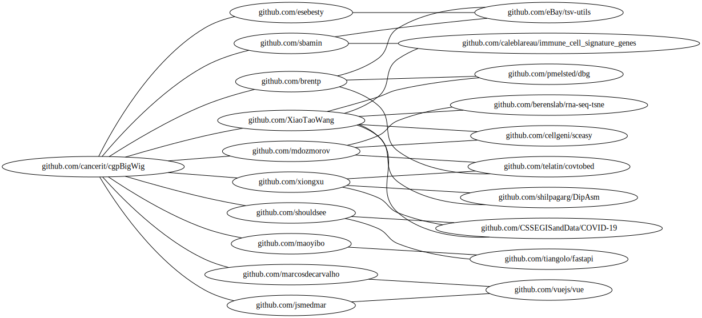

# github_graph

Intended for visualisation of github repo-user-graph using github v4 graphQL api.

### Require

1. `$token`: A personal github token to use graphQL api: https://help.github.com/en/github/authenticating-to-github/creating-a-personal-access-token-for-the-command-line

1. `pip3 install gql jinja2 graphviz --user`

1. `dot` binary from graphviz apt package `apt-get install graphviz`

```bash
bash run.sh $token cancerit/cgpBigWig

head ./temp.dot.txt.svg
```


